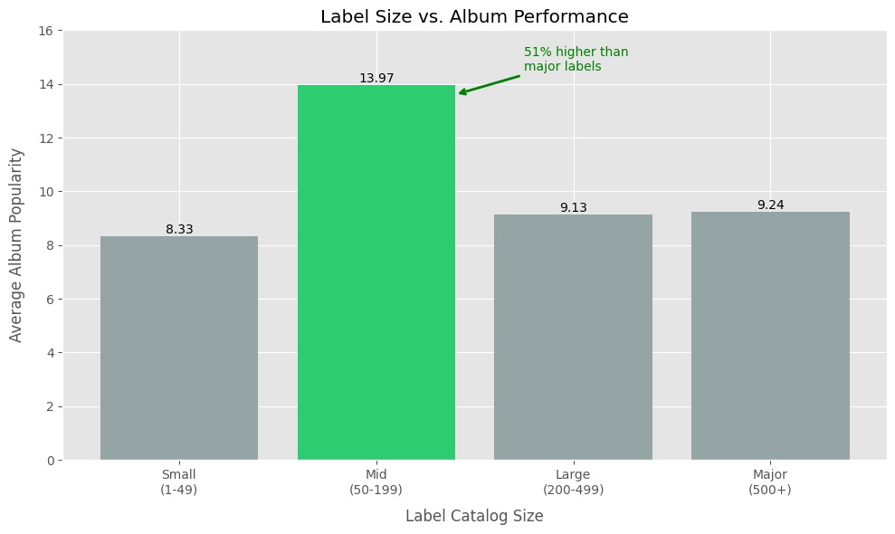
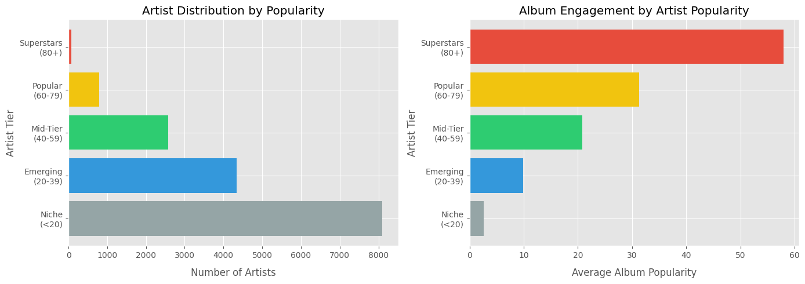
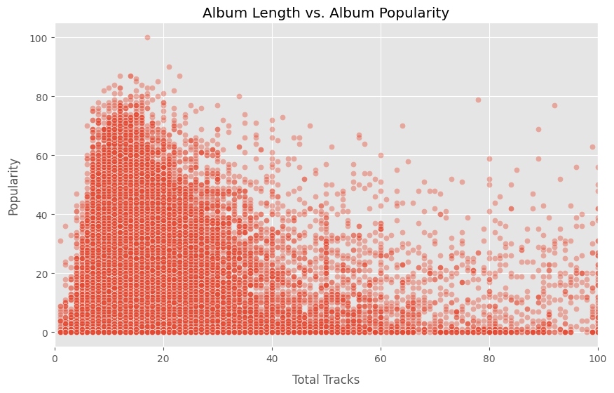
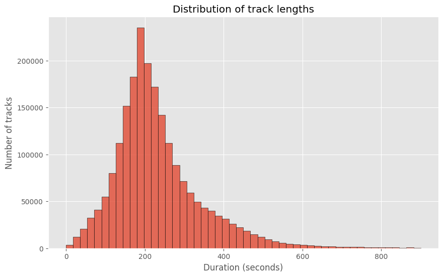
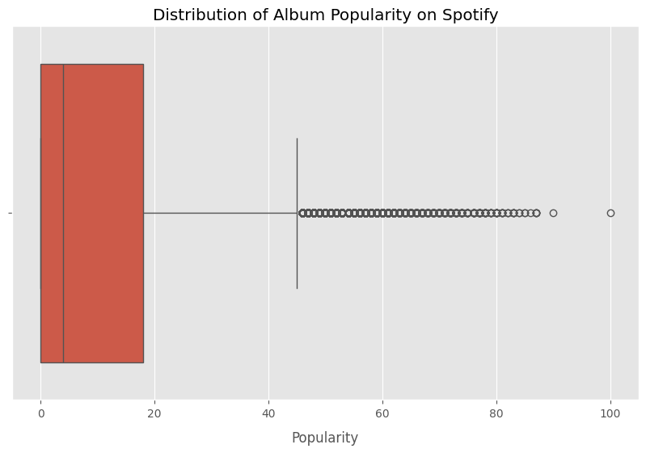
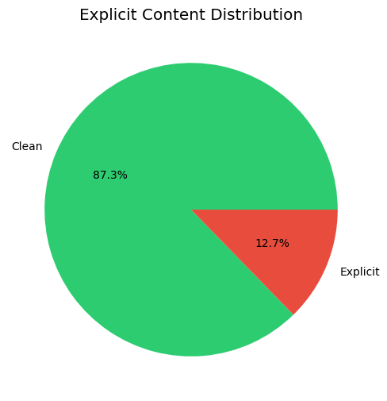

# Spotify Catalog Insights 2025

Analyzed 2M+ catalog records from Spotify's platform to uncover strategic patterns in label performance, artist concentration, and album composition. This project demonstrates end-to-end data analysis using Python and SQL to derive actionable insights for the music industry.

## Project Overview

This project performs comprehensive exploratory data analysis on Spotify's catalog data to understand competitive dynamics in digital music streaming. The analysis focuses on strategic business insights that challenge conventional assumptions about the music industry.

## Dataset Structure

The data was sourced from Spotify's Web API (July 2025) and consists of three core tables stored in PostgreSQL:

### `spotify_track`

Key fields:

- **Key fields:** `trackid`, `albumid`, `name`, `durationms`, `explicit`

- **Purpose:** Track-level attributes including duration and content ratings

### `spotify_album`

Key fields:

- **Key fields:** `popularity`, `totaltracks`, `name`, `label`, `releasedate`

- **Purpose:** Album-level success metrics and metadata

### `spotify_artist`

Key fields:

- **Key fields:** `popularity`, `totalfollowers`, `genres`, `lastsynctime`

- **Purpose:** Artist-level popularity and audience metrics

### Data Integrity

- No missing values in critical fields

- Minimal duplicates after initial data quality checks

> [!NOTE]
> The included sample CSV datasets each containing 10,000 rows are included for testing and demonstration. To reproduce the full analysis, [download the complete SQL dumps here](https://github.com/MusicMoveArr/Datasets) and restore it locally.

## Analysis Approach

This project combines SQL and Python to test three strategic hypotheses about the music streaming industry:

**1. Label Performance Hypothesis**  
*Does larger catalog size correlate with higher success?*

Grouped labels by catalog size (Small: 1-49, Mid: 50-199, Large: 200-499, Major: 500+ albums) and compared average album popularity across categories. Used SQL CTEs to calculate label sizes, then joined with album performance data to identify patterns.

**2. Artist Concentration Hypothesis**  
*How concentrated is success on streaming platforms?*

Segmented artists into popularity tiers (Niche <20, Emerging 20-39, Mid-Tier 40-59, Popular 60-79, Superstars 80+) and measured per-album engagement differentials. Calculated weighted averages to compare top-tier vs. bottom-tier performance.

**3. Album Composition Hypothesis**  
*Is there an optimal album length for maximizing popularity?*

Categorized albums by track count (EP ≤8, Standard 9-12, Long 13-16, Very Long 17-20, Deluxe 20+) and analyzed popularity distributions. Examined standard deviations to assess within-group variance and pattern consistency.

**Technical Implementation:**  
- SQL (PostgreSQL) for multi-table joins, data extraction, and categorical filtering
- Python (Pandas) for aggregation, statistical calculations, and derived metrics
- Matplotlib/Seaborn for visualization
- Filtered to `albumtype = 'album'` throughout for methodological consistency

For detailed SQL queries, data transformations, and visualization code, [see the Jupyter notebook](https://github.com/pktrance/Spotify-Catalog-Insights/blob/main/spotify-database-analysis-2025.ipynb).

## Key Findings

### 1. Mid-Size Label Advantage (Primary Finding)

Mid-size independent labels (50-199 albums) achieve **59% higher average album popularity** (14.49 avg) compared to major labels (9.11 avg), despite significantly smaller catalogs. This suggests that focused artist development and catalog curation provide competitive advantages over volume-based catalog strategies.

**Strategic Implication:** Independent labels should prioritize depth over breadth—concentrating resources on curating smaller rosters of artists and maintaining a selective record catalog rather than attempting to compete with major labels through catalog expansion.

**Technical approach:** Grouped labels by catalog size and compared average album popularity across categories using SQL aggregations and Python analysis.

### 2. Platform Concentration Dynamics (Secondary Finding)

The top 5% of artists (860 with 60+ popularity scores) achieve **4.3x higher per-album engagement** (33.5 avg popularity) compared to the remaining 95% (7.8 avg). This demonstrates the compounding advantage of established audience bases and algorithmic reinforcement.

**Strategic Implication:** Emerging artists should focus on building dedicated niche audiences rather than pursuing broad mainstream appeal, as breakthrough success creates self-reinforcing momentum through platform algorithms and listener behavior.

**Technical approach:** Grouped artists into popularity tiers and measured engagement differentials, controlling for catalog size and release type.

### 3. Album Composition Patterns

Albums with 13-16 tracks show highest popularity (13.74 avg), revealing a non-linear relationship that contradicts the simple "shorter is better" hypothesis. EP albums (≤8 tracks) significantly underperform (6.46 avg), possibly due to promotional nature or emerging artist prevalence.

**Observation:** High standard deviations across all categories indicate substantial within-group variation, suggesting album length is moderated by artist tier and genre conventions rather than being a universal success factor.

## Technical Highlights

- Processed and merged **2M+ catalog records** across multiple normalized tables
- Combined **SQL (PostgreSQL)** for data extraction and joins with **Python (Pandas)** for categorical grouping, aggregation, and visualization
- Created multi-dimensional aggregations to reveal patterns across label size, artist tiers, and album composition
- Filtered analysis to albums only (excluding singles/compilations) for methodological rigor
- Built visualizations to communicate findings to non-technical stakeholders

## Strategic Recommendations

> [!WARNING]
> These recommendations are based on trends observed in the data and interpret what they could imply for business strategy. Implementation would require validation through additional research.

### For Independent Labels

**Implications of catalog size findings:**
- Maintain catalog sizes within the 50-200 album range that demonstrated optimal performance
- Prioritize depth of artist development over breadth of catalog expansion
- Emphasize artist quality and strategic curation over volume targets
- Consider genre specialization strategies (2-3 complementary genres)

**Areas for further investigation:**
- Genre specialization patterns among mid-size labels
- Artist retention and development practices contributing to performance advantages
- Operational differences between mid-size and major label structures

### For Emerging Artists

**Implications of concentration dynamics:**
- Breaking into top 5% represents significant threshold given 4.3x engagement differential
- Strategic positioning decisions (genre selection, audience targeting, release timing) 
  warrant careful consideration
- Partnership choices should evaluate label performance patterns within specific genres
- Consider leveraging mid-size labels with proven track records in target genres

**Strategic considerations:**
- Audience building approaches favoring dedicated followings over broad reach
- Platform algorithm optimization (playlist placement, engagement metrics, release cadence)
- Long-term career development pathways in highly concentrated marketplace

### For Platform Strategy & Future Research

**Observations relevant to platform dynamics:**
- Mid-size label performance suggests value in content diversity beyond major partnerships
- Concentration patterns may inform discoverability feature development
- Album composition patterns could inform recommendation algorithms and playlist curation

**Research extensions:**
- User behavior analysis to understand mechanisms driving concentration
- Longitudinal studies tracking artist trajectory and tier mobility over time
- Genre-specific analysis to test pattern universality
- Cross-platform comparative analysis

## Visualizations

The project includes several key visualizations:

**1. Label Performance Analysis**
<br>
<br>*Mid-size independent labels (50-199 albums) achieve 59% higher average album popularity 
than major labels, demonstrating competitive advantage through focused curation.*

**2. Artist Concentration Dynamics**
<br>
<br>*Platform shows significant success concentration: top 5% of artists achieve 4.3x higher 
per-album engagement despite representing small fraction of catalog.*

**3. Album Composition Patterns**
<br>
<br>*Non-linear relationship between track count and popularity, with 13-16 track albums 
showing optimal performance.*

**4. Track Duration Distribution**
<br>
<br>*Majority of tracks concentrate around 180-210 seconds, aligning with playlist preferences.*

**5. Album Popularity Distribution**
<br>
<br>*Box plot reveals popularity score distribution and outlier identification.*

**6. Content Strategy**
<br>
<br>*12.7% of catalog is explicit content, with strategy varying by genre and audience.*

## Technical Stack

### Languages & Tools:

- **Python 3.11+:** Primary analysis environment
  - `pandas` – data manipulation and aggregation
  - `numpy` – numerical operations
  - `matplotlib` & `seaborn` – visualization
  - `psycopg2` – PostgreSQL connectivity

- **SQL (PostgreSQL 15+):** Data storage and extraction
  - Complex JOINs across normalized tables
  - Window functions for ranking and aggregation
  - CTEs for multi-step queries

### Environment:

- Jupyter Notebook for exploratory analysis and visualization
  
- `.env` file for credentials management (not committed to repo)

- Git for version control

## Setup Instructions

**1. Clone the repository**
```bash
git clone https://github.com/PKTrance/Spotify-Catalog-Insights.git
cd Spotify-Catalog-Insights
```

**2. Install dependencies**
```bash
pip install -r requirements.txt
```

**3. Set up environment variables**

Use `.env.example` to create a `.env` file in the project root with your credentials:

```bash
DB_USER=your_username
DB_PASS=your_password
DB_HOST=localhost
DB_PORT=5432
```

**4. Open the notebook:**
```bash
jupyter notebook spotify-database-analysis-2025.ipynb
```

## Files
- `spotify-database-analysis-2025.ipynb`
- `spotify_track_sample.csv`
- `spotify_album_sample.csv`
- `spotify_artist_sample.csv`
- `.env.example`
- `requirements.txt`
- `figures/`

## Acknowledgments

Special thanks to [MusicMoveArr](https://github.com/MusicMoveArr/Datasets) for sourcing and sharing the Spotify datasets used in this project.

## Contact

Patrick Tran — `https://www.linkedin.com/in/patricktran22/` — patricktran@g.ucla.edu
